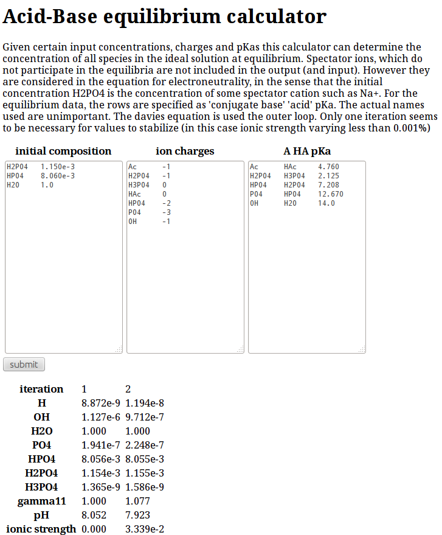

# Acid Base Equilibrium Calculator

It is desirable to know pH and composition for solutions. Acids react with bases. The acid becomes a conjugate base and the base becomes a conjugate acid. Equilibrium constants together with activity coefficients fix the ratio of acid to conjugate base, at a given pH. The Davies equation supplies activity coefficients here, which is straightforward to calculate if all charges and concentrations are known (ie. ionic strength). Once equations are added to conserve mass and charge from the initial concentrations, a square system of equations results.

